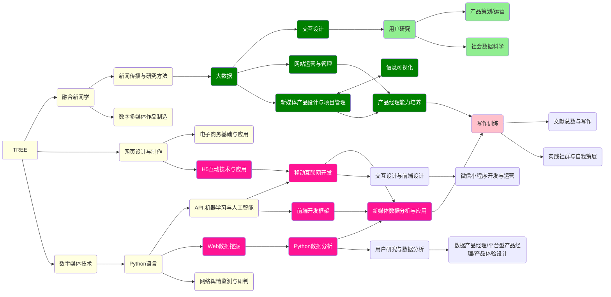

```mermaid
graph LR
A[TREE]-->B(融合新闻学)
A-->C(网页设计与制作)
A-->D(数字媒体技术)
B-->E(新闻传播与研究方法)
B-->F(数字多媒体作品制造)
E-->G(大数据)
G-->H(交互设计)
G-->I(网站运营与管理)
G-->J(新媒体产品设计与项目管理)
C-->K(电子商务基础与应用)
D-->L(Python语言)
L-->M(API.机器学习与人工智能)
L-->N(Web数据挖掘)
L-->O(网络舆情监测与研判)
J<-->P(信息可视化)
C-->Q(H5互动技术与应用)
H-->R(用户研究)
I-->S(产品经理能力培养)
J-->S(产品经理能力培养)
S-->T(写作训练)
N-->U(Python数据分析)
M-->V(移动互联网开发)
Q-->V(移动互联网开发)
M-->W(前端开发框架)
R-->X(产品策划/运营)
R-->Y(社会数据科学)
T-->Z(文献总数与写作)
T-->A1(实践社群与自我策展)
U-->A2(新媒体数据分析与应用)
V-->A2(新媒体数据分析与应用)
W-->A2(新媒体数据分析与应用)
U-->A3(用户研究与数据分析)
V-->A4(交互设计与前端设计)
A3-->A5(数据产品经理/平台型产品经理/产品体验设计)
A4-->A6(微信小程序开发与运营)
A2-->T(写作训练)

style G fill:green,color:white
style H fill:green,color:white
style I fill:green,color:white
style J fill:green,color:white
style P fill:green,color:white
style S fill:green,color:white
style N fill:deeppink,color:white
style Q fill:deeppink,color:white
style U fill:deeppink,color:white
style V fill:deeppink,color:white
style W fill:deeppink,color:white
style A2 fill:deeppink,color:white
style R fill:lightgreen
style X fill:lightgreen
style Y fill:lightgreen
style T fill:pink
style A fill:lightyellow
style B fill:lightyellow
style C fill:lightyellow
style D fill:lightyellow
style E fill:lightyellow
style F fill:lightyellow
style K fill:lightyellow
style L fill:lightyellow
style M fill:lightyellow
style O fill:lightyellow
```

